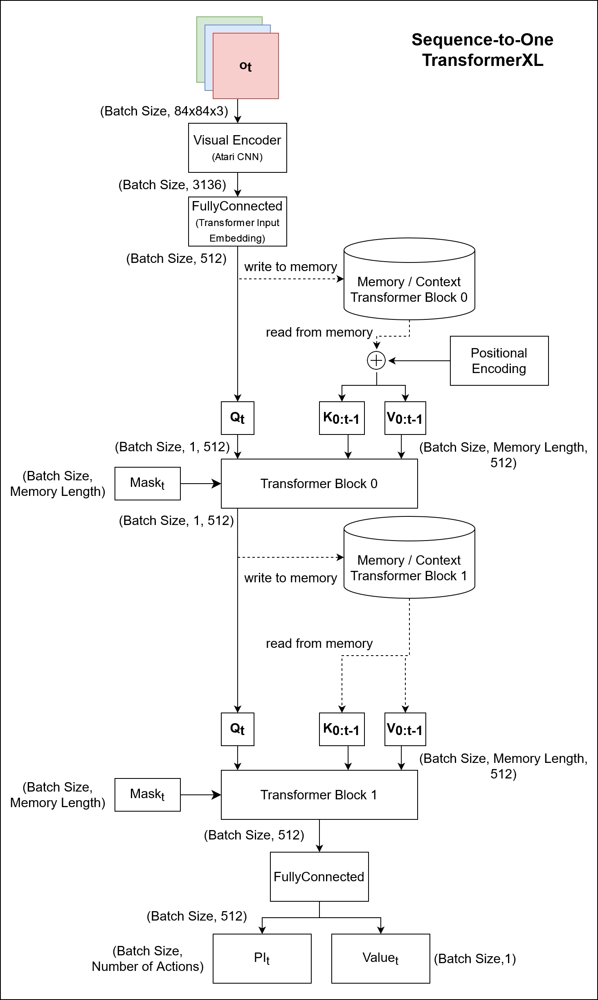
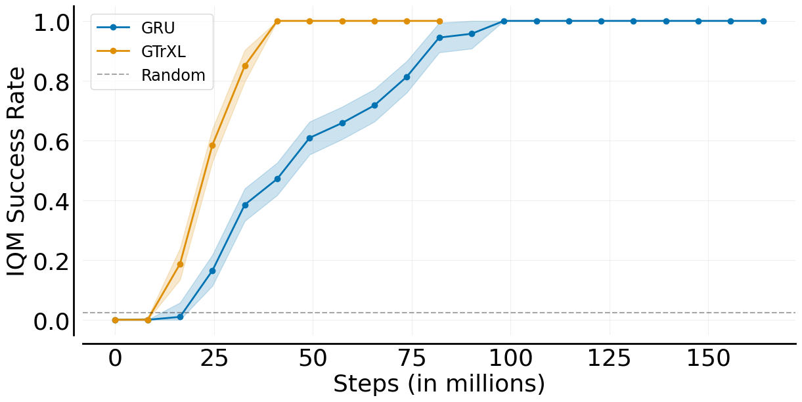

# TransformerXL as Episoic Memory in Proximal Policy Optimization

This repository features a PyTorch based implementation of PPO using TransformerXL (TrXL). Its intention is to provide a clean baseline/reference implementation on how to successfully employ memory-based agents using Transformers and PPO.

# Features

- Episodic Transformer Memory
  - TransformerXL (TrXL)
  - Gated TransformerXL (GTrXL)
- Environments
  - Proof-of-concept Memory Task (PocMemoryEnv)
  - CartPole
    - Masked velocity
  - Minigrid Memory
    - Visual Observation Space 3x84x84
    - Egocentric Agent View Size 3x3 (default 7x7)
    - Action Space: forward, rotate left, rotate right
  - [MemoryGym](https://github.com/MarcoMeter/drl-memory-gym)
    - Mortar Mayhem
    - Mystery Path
    - Searing Spotlights (WIP)
- Tensorboard
- Enjoy (watch a trained agent play)

# Citing this work

```bibtex
@article{pleines2023trxlppo,
  title = {TransformerXL as Episoic Memory in Proximal Policy Optimization},
  author = {Pleines, Marco and Pallasch, Matthias and Zimmer, Frank and Preuss, Mike},
  journal= {Github Repository},
  year = {2023},
  url = {https://github.com/MarcoMeter/episodic-transformer-memory-ppo}
}
```

# Contents

- [Installation](#installation)
- [Train a model](#train-a-model)
- [Enjoy a model](#enjoy-a-model)
- [Episodic Transformer Memory Concept](#episodic-transformer-memory-concept)
- [Hyperparameters](#hyperparameters)
      - [Episodic Transformer Memory](#episodic-transformer-memory)
      - [General](#general)
      - [Schedules](#schedules)
- [Add Environment](#add-environment)
- [Tensorboard](#tensorboard)
- [Results](#results)

# Installation

Install [PyTorch](https://pytorch.org/get-started/locally/) 1.12.1 depending on your platform. We recommend the usage of [Anaconda](https://www.anaconda.com/).

Create Anaconda environment:
```bash
conda create -n transformer-ppo python=3.7 --yes
conda activate transformer-ppo
```

CPU:
```bash
conda install pytorch==1.12.1 torchvision==0.13.1 torchaudio==0.12.1 cpuonly -c pytorch
```

CUDA:
```bash
conda install pytorch==1.12.1 torchvision==0.13.1 torchaudio==0.12.1 cudatoolkit=11.6 -c pytorch -c conda-forge
```

Install the remaining requirements and you are good to go:

```bash
pip install -r requirements.txt
```

# Train a model

The training is launched via `train.py`. `--config` specifies the path to the yaml config file featuring hyperparameters. The `--run-id` is used to distinguish training runs. After training, the trained model will be saved to `./models/$run-id$.nn`.

```bash
python train.py --config configs/minigrid.yaml --run-id=my-trxl-training
```

# Enjoy a model

To watch an agent exploit its trained model, execute `enjoy.py`. Some pre-trained models can be found in: `./models/`. The to-be-enjoyed model is specified using the `--model` flag.

```bash
python enjoy.py --model=models/mortar_mayhem_grid_trxl.nn
```

# Episodic Transformer Memory Concept



# Hyperparameters

#### Episodic Transformer Memory

<table>
  <thead>
    <tr>
      <th>Hyperparameter</th>
      <th>Description</th>
    </tr>
  </thead>
  <tbody>
    <tr>
      <td>num_blocks</td>
      <td>Number of transformer blocks</td>
    </tr>
    <tr>
      <td>embed_dim</td>
      <td>Embedding size of every layer inside a transformer block</td>
    </tr>
    <tr>
      <td>num_heads</td>
      <td>Number of heads used in the transformer's multi-head attention mechanism</td>
    </tr>
    <tr>
      <td>memory_length</td>
      <td>Length of the sliding episodic memory window</td>
    </tr>
    <tr>
      <td>positional_encoding</td>
      <td>Relative and learned positional encodings can be used</td>
    </tr>
    <tr>
      <td>layer_norm</td>
      <td>Whether to apply layer normalization before or after every transformer component. Pre layer normalization refers to the identity map re-ordering.</td>
    </tr>
    <tr>
      <td>gtrxl</td>
      <td>Whether to use Gated TransformerXL</td>
    </tr>
    <tr>
      <td>gtrxl_bias</td>
      <td>Initial value for GTrXL's bias weight</td>
    </tr>    
  </tbody>
</table>

#### General

<table>
  <tbody>
    <tr>
      <td>gamma</td>
      <td>Discount factor</td>
    </tr>
    <tr>
      <td>lamda</td>
      <td>Regularization parameter used when calculating the Generalized Advantage Estimation (GAE)</td>
    </tr>
    <tr>
      <td>updates</td>
      <td>Number of cycles that the entire PPO algorithm is being executed</td>
    </tr>
    <tr>
      <td>n_workers</td>
      <td>Number of environments that are used to sample training data</td>
    </tr>
    <tr>
      <td>worker_steps</td>
      <td>Number of steps an agent samples data in each environment (batch_size = n_workers * worker_steps)</td>
    </tr>
    <tr>
      <td>epochs</td>
      <td>Number of times that the whole batch of data is used for optimization using PPO</td>
    </tr>
    <tr>
      <td>n_mini_batch</td>
      <td>Number of mini batches that are trained throughout one epoch</td>
    </tr>
    <tr>
      <td>value_loss_coefficient</td>
      <td>Multiplier of the value function loss to constrain it</td>
    </tr>
    <tr>
      <td>hidden_layer_size</td>
      <td>Number of hidden units in each linear hidden layer</td>
    </tr>
    <tr>
      <td>max_grad_norm</td>
      <td>Gradients are clipped by the specified max norm</td>
    </tr>
  </tbody>
</table>

#### Schedules

These schedules can be used to polynomially decay the learning rate, the entropy bonus coefficient and the clip range.

<table>
    <tbody>
    <tr>
      <td>learning_rate_schedule</td>
      <td>The learning rate used by the AdamW optimizer</td>
    </tr>
    <tr>
      <td>beta_schedule</td>
      <td>Beta is the entropy bonus coefficient that is used to encourage exploration</td>
    </tr>
    <tr>
      <td>clip_range_schedule</td>
      <td>Strength of clipping losses done by the PPO algorithm</td>
    </tr>
  </tbody>
</table>

# Add Environment

Follow these steps to train another environment:

1. Implement a wrapper of your desired environment. It needs the properties `observation_space`, `action_space` and `max_episode_steps`. The needed functions are `render()`, `reset()` and `step`.
2. Extend the `create_env()` function in `utils.py` by adding another if-statement that queries the environment's "type"
3. Adjust the "type" and "name" key inside the environment's yaml config

Note that only environments with visual or vector observations are supported. Concerning the environment's action space, it can be either discrte or multi-discrete.

# Tensorboard

During training, tensorboard summaries are saved to `summaries/run-id/timestamp`.

Run `tensorboad --logdir=summaries` to watch the training statistics in your browser using the URL [http://localhost:6006/](http://localhost:6006/).

# Results

Every experiment is repeated on 5 random seeds. Each model checkpoint is evaluated on 50 unknown environment seeds, which are repeated 5 times. Hence, one data point aggregates 1250 (5x5x50) episodes. Rliable is used to retrieve the interquartile mean and the bootstrapped confidence interval. The training is conducted using the more sophisticated DRL framework [neroRL](https://github.com/MarcoMeter/neroRL). The clean GRU-PPO baseline can be found [here](https://github.com/MarcoMeter/recurrent-ppo-truncated-bptt).

## Mystery Path Grid (Goal & Origin Hidden)



TrXL and GTrXL have identical performance. See [Issue #7](https://github.com/MarcoMeter/episodic-transformer-memory-ppo/issues/7).
